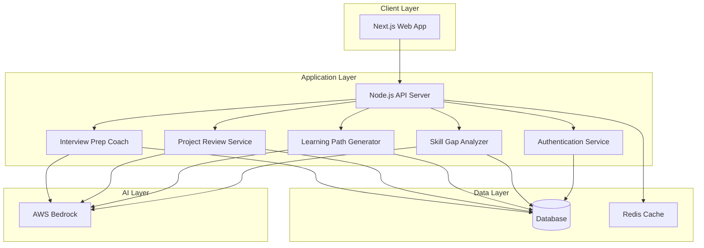

# Design Document: Sarthi - AI-Powered Career Navigation Platform

## Overview

Sarthi is a full-stack web application built with Next.js frontend and Node.js backend, leveraging AWS Bedrock for AI capabilities. The platform provides four core features: skill gap analysis, personalized learning path generation, AI-powered project reviews, and interview preparation coaching.

The architecture follows a three-tier pattern:
- **Presentation Layer**: Next.js application with React components
- **Application Layer**: Node.js REST API handling business logic
- **Data Layer**: Database (DynamoDB or MongoDB) for persistence and AWS Bedrock for AI processing

The system is designed to be scalable, supporting 1000+ concurrent users while maintaining sub-2-second response times for most operations.

## Architecture

### High-Level Architecture



### Technology Stack

**Frontend:**
- Next.js 14 with App Router
- React 18 for UI components
- TailwindCSS for styling
- React Query for data fetching and caching
- Zod for client-side validation

**Backend:**
- Node.js 20 with Express.js
- TypeScript for type safety
- JWT for authentication
- AWS SDK for Bedrock integration

**Database:**
- Primary: MongoDB for flexible schema and document storage
- Caching: Redis for session management and frequently accessed data

**AI/ML:**
- AWS Bedrock (Claude 3 Sonnet) for natural language processing and analysis

**Infrastructure:**
- AWS Lambda for serverless API deployment (optional)
- AWS CloudFront for CDN
- AWS S3 for static asset storage

### Database Choice: MongoDB

We choose MongoDB over DynamoDB for the following reasons:
1. **Flexible Schema**: Student profiles and project data have varying structures that benefit from document storage
2. **Complex Queries**: Skill gap analysis requires filtering and aggregation across multiple fields
3. **Easier Development**: MongoDB's query language is more intuitive for the development team
4. **Cost**: More predictable pricing for the expected usage patterns
5. **Local Development**: Easier to set up and test locally

## Components and Interfaces

### 1. Authentication Service

**Responsibility**: Handle user registration, login, session management, and password reset.

**Interface:**
```typescript
interface AuthService {
  // Register a new student
  register(email: string, password: string, name: string): Promise<AuthResult>
  
  // Authenticate student credentials
  login(email: string, password: string): Promise<AuthResult>
  
  // Validate JWT token and return student ID
  validateToken(token: string): Promise<string>
  
  // Initiate password reset flow
  requestPasswordReset(email: string): Promise<void>
  
  // Complete password reset with token
  resetPassword(token: string, newPassword: string): Promise<void>
  
  // Logout and invalidate session
  logout(token: string): Promise<void>
}

interface AuthResult {
  success: boolean
  token?: string
  studentId?: string
  error?: string
}
```

**Key Operations:**
- Password hashing using bcrypt (minimum 10 rounds)
- JWT token generation with 24-hour expiration
- Secure token storage in Redis with TTL
- Email validation using regex pattern
- Rate limiting on login attempts (5 attempts per 15 minutes)

### 2. Student Profile Service

**Responsibility**: Manage student profile data including skills, academic background, projects, and career goals.

**Interface:**
```typescript
interface StudentProfileService {
  // Create new student profile
  createProfile(studentId: string, profileData: ProfileData): Promise<StudentProfile>
  
  // Retrieve student profile
  getProfile(studentId: string): Promise<StudentProfile>
  
  // Update profile fields
  updateProfile(studentId: string, updates: Partial<ProfileData>): Promise<StudentProfile>
  
  // Add skill with proficiency level
  addSkill(studentId: string, skill: Skill): Promise<StudentProfile>
  
  // Update skill proficiency
  updateSkill(studentId: string, skillId: string, proficiency: number): Promise<StudentProfile>
  
  // Add project to profile
  addProject(studentId: string, project: Project): Promise<StudentProfile>
  
  // Set target roles
  setTargetRoles(studentId: string, roles: string[]): Promise<StudentProfile>
}

interface StudentProfile {
  studentId: string
  email: string
  name: string
  college: string
  degree: string
  graduationYear: number
  skills: Skill[]
  projects: Project[]
  targetRoles: string[]
  createdAt: Date
  updatedAt: Date
}

interface Skill {
  skillId: string
  name: string
  category: 'technical' | 'soft'
  proficiency: number // 1-5 scale
  addedAt: Date
}

interface Project {
  projectId: string
  title: string
  description: string
  technologies: string[]
  repositoryUrl?: string
  liveUrl?: string
  startDate: Date
  endDate?: Date
}
```

### 3. Skill Gap Analyzer

**Responsibility**: Analyze the gap between student's current skills and target role requirements using AI.

**Interface:**
```typescript
interface SkillGapAnalyzer {
  // Analyze skill gaps for a target role
  analyzeSkillGap(studentId: string, targetRole: string): Promise<SkillGapAnalysis>
  
  // Get industry requirements for a role
  getIndustryRequirements(role: string): Promise<RoleRequirements>
  
  // Get historical analyses for a student
  getAnalysisHistory(studentId: string): Promise<SkillGapAnalysis[]>
}

interface SkillGapAnalysis {
  analysisId: string
  studentId: string
  targetRole: string
  analyzedAt: Date
  currentSkills: Skill[]
  requiredSkills: RequiredSkill[]
  skillGaps: SkillGap[]
  overallReadiness: number // 0-100 percentage
}

interface RequiredSkill {
  name: string
  category: 'technical' | 'soft'
  importance: 'critical' | 'important' | 'nice-to-have'
  description: string
}

interface SkillGap {
  skillName: string
  category: 'technical' | 'soft'
  priority: 'high' | 'medium' | 'low'
  currentLevel: number // 0 if missing, 1-5 if present
  requiredLevel: number // 1-5
  estimatedLearningTime: string // e.g., "2-3 months"
  difficulty: 'beginner' | 'intermediate' | 'advanced'
}
```

**AI Integration:**
The Skill Gap Analyzer uses AWS Bedrock to:
1. Parse and understand target role descriptions
2. Extract required skills from job market data
3. Compare student skills against requirements
4. Generate learning time estimates based on skill complexity

**Prompt Template:**
```
Analyze the skill gap for a student targeting the role: {targetRole}

Student's current skills:
{skillsList}

Provide:
1. List of required skills for this role in the Indian job market
2. Categorize each skill by importance (critical/important/nice-to-have)
3. Identify gaps between current and required skills
4. Estimate learning time for each gap
5. Prioritize gaps by importance and prerequisite dependencies

Format the response as JSON matching the SkillGapAnalysis schema.
```

### 4. Learning Path Generator

**Responsibility**: Create personalized, sequential learning roadmaps based on skill gaps.

**Interface:**
```typescript
interface LearningPathGenerator {
  // Generate learning path for target role
  generateLearningPath(studentId: string, targetRole: string): Promise<LearningPath>
  
  // Update progress on a learning milestone
  updateMilestoneProgress(studentId: string, pathId: string, milestoneId: string, completed: boolean): Promise<LearningPath>
  
  // Get active learning paths for student
  getActivePaths(studentId: string): Promise<LearningPath[]>
}

interface LearningPath {
  pathId: string
  studentId: string
  targetRole: string
  createdAt: Date
  estimatedDuration: string // e.g., "6 months"
  milestones: Milestone[]
  overallProgress: number // 0-100 percentage
}

interface Milestone {
  milestoneId: string
  title: string
  description: string
  skillsAddressed: string[]
  resources: LearningResource[]
  estimatedTime: string
  prerequisites: string[] // milestoneIds
  completed: boolean
  completedAt?: Date
}

interface LearningResource {
  resourceId: string
  title: string
  type: 'video' | 'article' | 'course' | 'book' | 'practice'
  url: string
  provider: string
  cost: 'free' | 'paid'
  duration: string
  difficulty: 'beginner' | 'intermediate' | 'advanced'
}
```

**AI Integration:**
The Learning Path Generator uses AWS Bedrock to:
1. Sequence learning milestones based on prerequisite dependencies
2. Recommend appropriate learning resources
3. Estimate realistic timelines based on skill complexity
4. Prioritize free and affordable resources for tier-2/3 students

**Prompt Template:**
```
Create a personalized learning path for a student with the following skill gaps:
{skillGaps}

Target role: {targetRole}
Student background: {studentProfile}

Requirements:
1. Create sequential milestones with clear prerequisites
2. Recommend FREE or affordable resources (prioritize Indian platforms)
3. Include practical projects for hands-on learning
4. Provide realistic time estimates
5. Focus on skills most demanded in Indian job market

Format the response as JSON matching the LearningPath schema.
```

### 5. Project Review Service

**Responsibility**: Analyze student projects and provide actionable feedback for improvement.

**Interface:**
```typescript
interface ProjectReviewService {
  // Submit project for AI review
  submitProjectForReview(studentId: string, projectId: string): Promise<ProjectReview>
  
  // Get review for a project
  getProjectReview(reviewId: string): Promise<ProjectReview>
  
  // Get all reviews for a student
  getStudentReviews(studentId: string): Promise<ProjectReview[]>
}

interface ProjectReview {
  reviewId: string
  projectId: string
  studentId: string
  reviewedAt: Date
  overallScore: number // 0-100
  isProductionReady: boolean
  codeQuality: CodeQualityAnalysis
  documentation: DocumentationAnalysis
  bestPractices: BestPracticesAnalysis
  recommendations: Recommendation[]
}

interface CodeQualityAnalysis {
  score: number // 0-100
  issues: CodeIssue[]
  strengths: string[]
}

interface CodeIssue {
  severity: 'critical' | 'major' | 'minor'
  category: 'security' | 'performance' | 'maintainability' | 'style'
  description: string
  location?: string // file path or line number
  suggestion: string
}

interface DocumentationAnalysis {
  score: number // 0-100
  hasReadme: boolean
  hasSetupInstructions: boolean
  hasApiDocs: boolean
  missingElements: string[]
  suggestions: string[]
}

interface BestPracticesAnalysis {
  score: number // 0-100
  followsPatterns: string[]
  violations: string[]
  suggestions: string[]
}

interface Recommendation {
  priority: 'high' | 'medium' | 'low'
  category: string
  title: string
  description: string
  implementationGuide: string
  estimatedEffort: string
}
```

**AI Integration:**
The Project Review Service uses AWS Bedrock to:
1. Analyze code structure and quality
2. Identify security vulnerabilities and anti-patterns
3. Evaluate documentation completeness
4. Generate specific, actionable recommendations
5. Assess production-readiness

**Prompt Template:**
```
Review the following student project:

Project Title: {title}
Description: {description}
Technologies: {technologies}
Repository: {repositoryUrl}

Code Sample: {codeSample}
README Content: {readmeContent}

Analyze:
1. Code quality (structure, readability, maintainability)
2. Security vulnerabilities
3. Best practices adherence
4. Documentation completeness
5. Production-readiness

Provide:
- Overall score and production-ready assessment
- Specific issues with severity levels
- Prioritized recommendations with implementation guidance
- Strengths to highlight

Format the response as JSON matching the ProjectReview schema.
```

### 6. Interview Prep Coach

**Responsibility**: Provide interview preparation guidance with role-specific questions and feedback.

**Interface:**
```typescript
interface InterviewPrepCoach {
  // Start new interview prep session
  startPrepSession(studentId: string, targetRole: string, sessionType: 'technical' | 'behavioral' | 'mixed'): Promise<PrepSession>
  
  // Get next question in session
  getNextQuestion(sessionId: string): Promise<InterviewQuestion>
  
  // Submit answer and get feedback
  submitAnswer(sessionId: string, questionId: string, answer: string): Promise<AnswerFeedback>
  
  // End session and get summary
  endSession(sessionId: string): Promise<SessionSummary>
  
  // Get prep history for student
  getPrepHistory(studentId: string): Promise<PrepSession[]>
}

interface PrepSession {
  sessionId: string
  studentId: string
  targetRole: string
  sessionType: 'technical' | 'behavioral' | 'mixed'
  startedAt: Date
  endedAt?: Date
  questions: InterviewQuestion[]
  currentQuestionIndex: number
}

interface InterviewQuestion {
  questionId: string
  type: 'technical' | 'behavioral' | 'coding' | 'system-design'
  difficulty: 'easy' | 'medium' | 'hard'
  question: string
  context?: string
  hints?: string[]
  expectedKeyPoints: string[]
}

interface AnswerFeedback {
  questionId: string
  studentAnswer: string
  score: number // 0-100
  strengths: string[]
  improvements: string[]
  missedKeyPoints: string[]
  suggestedAnswer: string
  followUpQuestions?: string[]
}

interface SessionSummary {
  sessionId: string
  totalQuestions: number
  averageScore: number
  strongAreas: string[]
  improvementAreas: string[]
  recommendations: string[]
}
```

**AI Integration:**
The Interview Prep Coach uses AWS Bedrock to:
1. Generate role-specific interview questions
2. Evaluate student answers for completeness and accuracy
3. Provide constructive feedback
4. Suggest follow-up questions based on answers
5. Identify patterns in student responses

**Prompt Template:**
```
Generate interview questions for:
Role: {targetRole}
Question Type: {sessionType}
Student Level: {studentSkillLevel}
Previous Performance: {previousSessionSummary}

Generate 5 questions that:
1. Match the role requirements
2. Are appropriate for tier-2/3 engineering students
3. Cover both fundamentals and practical application
4. Include behavioral scenarios relevant to Indian workplace culture

Format the response as JSON matching the InterviewQuestion schema.
```

### 7. AWS Bedrock Integration Service

**Responsibility**: Centralized service for all AWS Bedrock API interactions.

**Interface:**
```typescript
interface BedrockService {
  // Send prompt to Bedrock and get response
  generateCompletion(prompt: string, config: BedrockConfig): Promise<string>
  
  // Parse and validate JSON response from Bedrock
  parseStructuredResponse<T>(response: string, schema: ZodSchema<T>): Promise<T>
  
  // Handle rate limiting and retries
  withRateLimit<T>(operation: () => Promise<T>): Promise<T>
}

interface BedrockConfig {
  modelId: string // e.g., 'anthropic.claude-3-sonnet-20240229-v1:0'
  temperature: number // 0-1
  maxTokens: number
  topP?: number
}
```

**Implementation Details:**
- Use AWS SDK v3 for Bedrock Runtime
- Implement exponential backoff for retries (max 3 attempts)
- Rate limiting: 10 requests per second per service
- Request timeout: 30 seconds
- Response validation using Zod schemas
- Error handling with graceful degradation

## Data Models

### MongoDB Collections

**students**
```typescript
{
  _id: ObjectId,
  email: string (unique, indexed),
  passwordHash: string,
  name: string,
  college: string,
  degree: string,
  graduationYear: number,
  skills: [
    {
      skillId: string,
      name: string,
      category: 'technical' | 'soft',
      proficiency: number,
      addedAt: Date
    }
  ],
  projects: [
    {
      projectId: string,
      title: string,
      description: string,
      technologies: string[],
      repositoryUrl: string,
      liveUrl: string,
      startDate: Date,
      endDate: Date
    }
  ],
  targetRoles: string[],
  createdAt: Date,
  updatedAt: Date
}
```

**skillGapAnalyses**
```typescript
{
  _id: ObjectId,
  analysisId: string (unique, indexed),
  studentId: string (indexed),
  targetRole: string,
  analyzedAt: Date,
  currentSkills: Skill[],
  requiredSkills: RequiredSkill[],
  skillGaps: SkillGap[],
  overallReadiness: number
}
```

**learningPaths**
```typescript
{
  _id: ObjectId,
  pathId: string (unique, indexed),
  studentId: string (indexed),
  targetRole: string,
  createdAt: Date,
  estimatedDuration: string,
  milestones: Milestone[],
  overallProgress: number
}
```

**projectReviews**
```typescript
{
  _id: ObjectId,
  reviewId: string (unique, indexed),
  projectId: string (indexed),
  studentId: string (indexed),
  reviewedAt: Date,
  overallScore: number,
  isProductionReady: boolean,
  codeQuality: CodeQualityAnalysis,
  documentation: DocumentationAnalysis,
  bestPractices: BestPracticesAnalysis,
  recommendations: Recommendation[]
}
```

**prepSessions**
```typescript
{
  _id: ObjectId,
  sessionId: string (unique, indexed),
  studentId: string (indexed),
  targetRole: string,
  sessionType: 'technical' | 'behavioral' | 'mixed',
  startedAt: Date,
  endedAt: Date,
  questions: InterviewQuestion[],
  answers: AnswerFeedback[],
  summary: SessionSummary
}
```

### Redis Cache Structure

**Session Tokens:**
```
Key: session:{token}
Value: {studentId: string, expiresAt: number}
TTL: 24 hours
```

**Rate Limiting:**
```
Key: ratelimit:{service}:{identifier}
Value: {count: number}
TTL: 60 seconds
```

**Cached Profiles:**
```
Key: profile:{studentId}
Value: JSON.stringify(StudentProfile)
TTL: 5 minutes
```


## Correctness Properties

*A property is a characteristic or behavior that should hold true across all valid executions of a system—essentially, a formal statement about what the system should do. Properties serve as the bridge between human-readable specifications and machine-verifiable correctness guarantees.*

### Property Reflection

After analyzing all acceptance criteria, I've identified the following redundancies to eliminate:

- Properties 1.2 (skill storage) and 1.4 (project storage) can be combined into a general "profile data persistence" property
- Properties 2.2 (gap identification) and 2.3 (gap categories) can be combined into one comprehensive gap analysis property
- Properties 8.1 (immediate persistence) and 8.4 (data consistency) overlap significantly and can be combined
- Properties 4.1 (review completeness) and 4.2 (issue categories) can be combined into one comprehensive review property

### Student Profile Management Properties

**Property 1: Profile creation completeness**
*For any* valid registration data (email, password, name), creating a student profile should result in a retrievable profile with all provided fields correctly populated.
**Validates: Requirements 1.1**

**Property 2: Profile data persistence and consistency**
*For any* student profile and any valid update (skills, projects, academic background, target roles), the update should be immediately retrievable and all fields should remain consistent across concurrent operations.
**Validates: Requirements 1.2, 1.3, 1.4, 1.5, 8.1, 8.4**

### Skill Gap Analysis Properties

**Property 3: Industry requirements retrieval**
*For any* valid target role, requesting skill gap analysis should retrieve a non-empty set of industry requirements for that role.
**Validates: Requirements 2.1**

**Property 4: Comprehensive gap identification**
*For any* student profile and target role, the skill gap analysis should identify all missing skills, categorize them by priority, include both technical and soft skills, and provide difficulty and time estimates for each gap.
**Validates: Requirements 2.2, 2.3, 2.4**

**Property 5: Analysis reflects profile changes**
*For any* student profile, if skills are added to the profile, then a subsequent skill gap analysis should reflect the reduced gaps.
**Validates: Requirements 2.5**

### Learning Path Generation Properties

**Property 6: Learning path completeness**
*For any* skill gap analysis, the generated learning path should include milestones addressing all identified skill gaps, with each milestone having an estimated completion time.
**Validates: Requirements 3.1, 3.4**

**Property 7: Prerequisite ordering**
*For any* learning path, if milestone A is a prerequisite for milestone B, then milestone A should appear before milestone B in the sequence.
**Validates: Requirements 3.2**

**Property 8: Affordable resource inclusion**
*For any* generated learning path, at least 50% of the recommended resources should be marked as free or affordable.
**Validates: Requirements 3.3**

**Property 9: Milestone completion updates profile**
*For any* learning path milestone, marking it as complete should update the student's skill profile and trigger recalculation of remaining skill gaps.
**Validates: Requirements 3.5**

### Project Review Properties

**Property 10: Comprehensive project analysis**
*For any* submitted project, the review should include analysis of code quality, documentation, and structure, with identified issues categorized as security, performance, maintainability, or style concerns.
**Validates: Requirements 4.1, 4.2**

**Property 11: Production readiness assessment**
*For any* project review, the result should include a boolean production-ready assessment and an overall score between 0-100.
**Validates: Requirements 4.4**

**Property 12: Prioritized recommendations**
*For any* project review, all recommendations should have a priority level (high/medium/low) and include implementation guidance.
**Validates: Requirements 4.5**

**Property 13: Documentation completeness check**
*For any* project review, the documentation analysis should explicitly check for README, setup instructions, and API documentation, reporting which elements are present or missing.
**Validates: Requirements 4.6**

### Interview Preparation Properties

**Property 14: Role-specific question generation**
*For any* interview prep session and target role, all generated questions should reference skills or concepts relevant to that target role.
**Validates: Requirements 5.1, 5.4**

**Property 15: Question type diversity**
*For any* interview prep session of type "mixed", the question set should include at least one technical question and at least one behavioral question.
**Validates: Requirements 5.2**

**Property 16: Answer feedback provision**
*For any* submitted answer to an interview question, the system should return feedback including a score, strengths, and areas for improvement.
**Validates: Requirements 5.3**

**Property 17: Progress tracking**
*For any* student with completed interview prep sessions, the system should maintain a history of all sessions and identify areas needing more practice based on low-scoring question categories.
**Validates: Requirements 5.5**

### Authentication and Security Properties

**Property 18: Invalid credential rejection**
*For any* registration or login attempt with invalid email format or weak password (less than 8 characters), the system should reject the request with an appropriate error message.
**Validates: Requirements 6.1**

**Property 19: Authentication creates valid sessions**
*For any* valid login credentials, authentication should create a session token that can be validated to retrieve the correct student ID.
**Validates: Requirements 6.2**

**Property 20: Expired session rejection**
*For any* expired session token, attempts to access protected resources should be rejected with an authentication error.
**Validates: Requirements 6.3**

**Property 21: Password reset token generation**
*For any* valid password reset request, the system should generate a unique reset token and associate it with the student's email.
**Validates: Requirements 6.5**

### AI Integration Properties

**Property 22: AI request context inclusion**
*For any* AI analysis request (skill gap, learning path, project review, interview prep), the request to AWS Bedrock should include relevant student context such as current skills, target role, and academic background.
**Validates: Requirements 7.1, 7.5**

**Property 23: AI response validation**
*For any* response from AWS Bedrock, the system should validate the response against the expected schema before storing or presenting it to students.
**Validates: Requirements 7.2**

**Property 24: AI service error handling**
*For any* failed AWS Bedrock request, the system should return a user-friendly error message and queue the request for retry with exponential backoff.
**Validates: Requirements 7.3**

**Property 25: AI rate limiting**
*For any* service making AI requests, if more than 10 requests are made within 1 second, subsequent requests should be rate-limited or queued.
**Validates: Requirements 7.4**

### Data Persistence Properties

**Property 26: Database error handling**
*For any* database operation failure, the system should log the error with relevant context and return an appropriate error message to the user without exposing internal details.
**Validates: Requirements 8.3**

**Property 27: Historical data retrieval**
*For any* student, querying for skill gap analysis history should return all previously generated analyses in reverse chronological order.
**Validates: Requirements 8.5**

### User Interface Properties

**Property 28: Loading state indicators**
*For any* asynchronous operation (data fetching, AI analysis), the UI should display a loading indicator while the operation is in progress.
**Validates: Requirements 9.3**

**Property 29: Error message display**
*For any* error condition (validation failure, server error, network error), the UI should display an error message to the user.
**Validates: Requirements 9.4**

**Property 30: Long operation progress indicators**
*For any* AI-powered analysis operation taking longer than 3 seconds, the system should display a progress indicator or status message.
**Validates: Requirements 10.2**

## Error Handling

### Error Categories

**1. Validation Errors**
- Invalid email format
- Weak password (< 8 characters)
- Missing required fields
- Invalid skill proficiency values (must be 1-5)
- Invalid date ranges

**Response:** HTTP 400 Bad Request with specific field errors

**2. Authentication Errors**
- Invalid credentials
- Expired session token
- Missing authentication token
- Insufficient permissions

**Response:** HTTP 401 Unauthorized or 403 Forbidden with error message

**3. Resource Not Found**
- Student profile not found
- Project not found
- Learning path not found
- Review not found

**Response:** HTTP 404 Not Found with resource identifier

**4. External Service Errors**
- AWS Bedrock unavailable
- AWS Bedrock rate limit exceeded
- AWS Bedrock timeout
- Invalid AI response format

**Response:** HTTP 503 Service Unavailable with retry guidance

**5. Database Errors**
- Connection failure
- Query timeout
- Constraint violation
- Transaction failure

**Response:** HTTP 500 Internal Server Error with generic message (log details internally)

### Error Handling Strategy

**Client-Side:**
- Display user-friendly error messages
- Provide actionable guidance for resolution
- Implement retry logic for transient failures
- Log errors to monitoring service

**Server-Side:**
- Log all errors with context (request ID, user ID, timestamp)
- Implement circuit breaker for external services
- Use exponential backoff for retries
- Return appropriate HTTP status codes
- Never expose internal implementation details in error messages

**AI Service Failures:**
- Queue failed requests for retry (max 3 attempts)
- Provide fallback responses when possible
- Alert monitoring system for sustained failures
- Implement graceful degradation (e.g., show cached results)

## Testing Strategy

### Dual Testing Approach

The Sarthi platform requires both unit testing and property-based testing for comprehensive coverage:

**Unit Tests** focus on:
- Specific examples of correct behavior
- Edge cases (empty inputs, boundary values)
- Error conditions and exception handling
- Integration points between components
- Mock external dependencies (AWS Bedrock, database)

**Property-Based Tests** focus on:
- Universal properties that hold for all inputs
- Comprehensive input coverage through randomization
- Invariants that must be maintained
- Round-trip properties (serialize/deserialize, encode/decode)
- Relationship properties between operations

### Property-Based Testing Configuration

**Framework:** fast-check (for TypeScript/JavaScript)

**Configuration:**
- Minimum 100 iterations per property test
- Each test tagged with: `Feature: sarthi, Property {number}: {property_text}`
- Use custom generators for domain objects (StudentProfile, SkillGap, etc.)
- Seed tests for reproducibility in CI/CD

**Example Property Test Structure:**
```typescript
// Feature: sarthi, Property 2: Profile data persistence and consistency
test('profile updates are immediately retrievable', async () => {
  await fc.assert(
    fc.asyncProperty(
      fc.record({
        studentId: fc.uuid(),
        skills: fc.array(skillGenerator()),
        projects: fc.array(projectGenerator())
      }),
      async (profileUpdate) => {
        // Update profile
        await profileService.updateProfile(profileUpdate.studentId, profileUpdate)
        
        // Immediately retrieve
        const retrieved = await profileService.getProfile(profileUpdate.studentId)
        
        // Verify all fields match
        expect(retrieved.skills).toEqual(profileUpdate.skills)
        expect(retrieved.projects).toEqual(profileUpdate.projects)
      }
    ),
    { numRuns: 100 }
  )
})
```

### Test Coverage Goals

- Unit test coverage: 80% minimum
- Property test coverage: All 30 correctness properties
- Integration test coverage: All API endpoints
- E2E test coverage: Critical user flows (registration, skill gap analysis, project review)

### Testing Environments

**Local Development:**
- MongoDB in Docker container
- Redis in Docker container
- Mock AWS Bedrock responses
- Fast-check for property tests
- Jest for unit tests

**CI/CD Pipeline:**
- Automated test execution on every commit
- Property tests with fixed seeds for reproducibility
- Integration tests against test database
- E2E tests using Playwright

**Staging:**
- Full integration with AWS Bedrock (test model)
- Real database with test data
- Performance testing with realistic load
- Security scanning

### Key Test Scenarios

**1. Student Profile Management**
- Create profile with various valid inputs
- Update profile fields concurrently
- Add skills with different proficiency levels
- Add projects with optional fields

**2. Skill Gap Analysis**
- Analyze gaps for various target roles
- Handle students with no skills
- Handle students with all required skills
- Update analysis after profile changes

**3. Learning Path Generation**
- Generate paths for different skill gaps
- Verify prerequisite ordering
- Check resource affordability
- Update progress and recalculate gaps

**4. Project Review**
- Review projects with various technologies
- Handle projects without documentation
- Identify security issues
- Generate prioritized recommendations

**5. Interview Preparation**
- Generate questions for different roles
- Evaluate answers with varying quality
- Track progress across multiple sessions
- Identify improvement areas

**6. Authentication & Security**
- Register with invalid emails/passwords
- Login with correct/incorrect credentials
- Access protected resources with expired tokens
- Reset password flow

**7. AI Integration**
- Handle Bedrock timeouts
- Validate AI response schemas
- Implement rate limiting
- Queue and retry failed requests

**8. Error Handling**
- Database connection failures
- Invalid input validation
- External service unavailability
- Concurrent update conflicts

### Performance Testing

While not part of correctness properties, performance testing should verify:
- Page load times < 2 seconds
- API response times < 500ms (excluding AI operations)
- AI operations complete within 30 seconds
- Support for 1000 concurrent users
- Database query optimization with proper indexes

### Security Testing

- SQL injection prevention (using parameterized queries)
- XSS prevention (input sanitization)
- CSRF protection (tokens)
- Rate limiting on authentication endpoints
- Secure password storage (bcrypt with 10+ rounds)
- JWT token validation and expiration
- HTTPS enforcement
- Sensitive data encryption

## Deployment Architecture

### Production Environment

**Frontend Deployment:**
- Next.js deployed on Vercel or AWS Amplify
- Static assets served via CloudFront CDN
- Environment-specific configuration

**Backend Deployment:**
- Node.js API on AWS ECS (Fargate) or EC2
- Auto-scaling based on CPU/memory usage
- Load balancer for traffic distribution
- Health checks and automatic recovery

**Database:**
- MongoDB Atlas (managed service)
- Replica set for high availability
- Automated backups (daily)
- Point-in-time recovery enabled

**Caching:**
- Redis on AWS ElastiCache
- Cluster mode for high availability
- Automatic failover

**AI Service:**
- AWS Bedrock in same region as backend
- Request/response logging for debugging
- Cost monitoring and alerts

### Monitoring and Observability

**Application Monitoring:**
- CloudWatch for logs and metrics
- Custom metrics for AI request latency
- Error rate tracking
- User activity analytics

**Alerts:**
- High error rates (> 5%)
- AI service failures
- Database connection issues
- High response times (> 2s)
- Rate limit violations

**Logging:**
- Structured JSON logs
- Request ID tracking across services
- PII redaction in logs
- Log retention: 30 days

### Security Considerations

**Data Protection:**
- Encrypt sensitive data at rest (AES-256)
- TLS 1.3 for data in transit
- Regular security audits
- Dependency vulnerability scanning

**Access Control:**
- JWT-based authentication
- Role-based access control (future: admin roles)
- API rate limiting
- CORS configuration

**Compliance:**
- GDPR considerations for user data
- Data retention policies
- User data export capability
- Account deletion capability

### Scalability Considerations

**Horizontal Scaling:**
- Stateless API servers (scale with load)
- Database read replicas for read-heavy operations
- Redis cluster for distributed caching

**Vertical Scaling:**
- Database instance sizing based on data growth
- Cache memory allocation based on usage patterns

**Cost Optimization:**
- Cache frequently accessed data (profiles, role requirements)
- Batch AI requests where possible
- Use appropriate AWS Bedrock model (balance cost vs. quality)
- Implement request deduplication
- Archive old analysis data

### Future Enhancements

**Phase 2 Features:**
- Resume builder and review
- Mock interview with voice interaction
- Peer learning communities
- Mentor matching
- Job board integration
- Company-specific preparation tracks

**Technical Improvements:**
- GraphQL API for flexible data fetching
- Real-time notifications (WebSocket)
- Offline support (PWA)
- Mobile native apps (React Native)
- Advanced analytics dashboard
- A/B testing framework

**AI Enhancements:**
- Fine-tuned models for Indian job market
- Multi-modal project review (analyze UI screenshots)
- Personalized learning content generation
- Predictive analytics for career success
- Automated skill assessment tests
